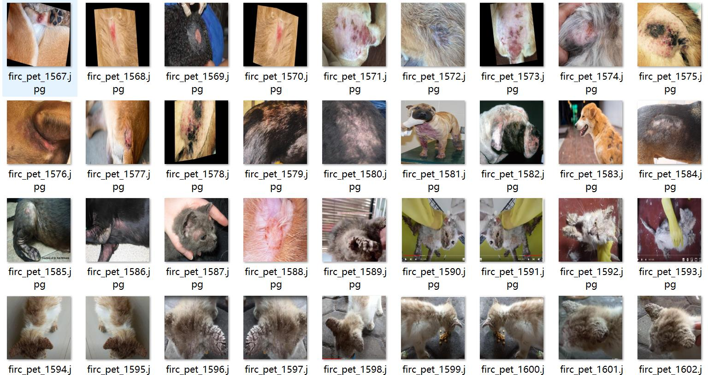

# Pet Skin Disease Detection Dataset VOC+YOLO Format: 1800 Images in 6 Categories

Please note that one-third of the images are original, and the remaining are enhanced images, mainly for cat and dog skin diseases.
The dataset format is Pascal VOC format plus YOLO format (without the segmentation path's txt file, only containing jpeg images, corresponding VOC format xml files, and yolo format txt files).
There are 1800 images in the jpeg file count.
There are 1800 xml file counts.
There are 1800 txt file counts.
The number of categories is 6.
The label order in the yolo format does not correspond to this, but it is based on the labels folder "classes.txt".
The box numbers for each category are as follows:
bacterial-dermatosis (bacterial dermatitis) boxes = 400
demodicosis (Demodecosis) boxes = 363
flea-allergy (Allergy to fleas) boxes = 232
fungal-infection (Fungal infection) boxes = 414
inflammatory-dermatitis (Inflammatory dermatitis) boxes = 271
scabies (Scabies) boxes = 242
Total box numbers = 1922
Each category has a certain number of images:
bacterial-dermatosis (bacterial dermatitis) image count = 378
demodicosis (Demodecosis) image count = 360
flea-allergy (Allergy to fleas) image count = 222
fungal-infection (Fungal infection) image count = 382
inflammatory-dermatitis (Inflammatory dermatitis) image count = 260
scabies (Scabies) image count = 198
Image resolution: 640x640
Labeling tool used: labelImg
Labeling rules: draw a box around the category.
Important notice: The dataset does not have split training/validation/test sets; you will need to do so yourself.
Special declaration: This dataset does not guarantee any accuracy in the trained models or weight files.
Image preview:

## Images

Here is a pay link on Stripe ( https://buy.stripe.com/3cs8yP7sY87d0vu9AB ). Please contact me lonlonago@foxmail.com after funding $89, and I will send you a complete data files , thank you!

